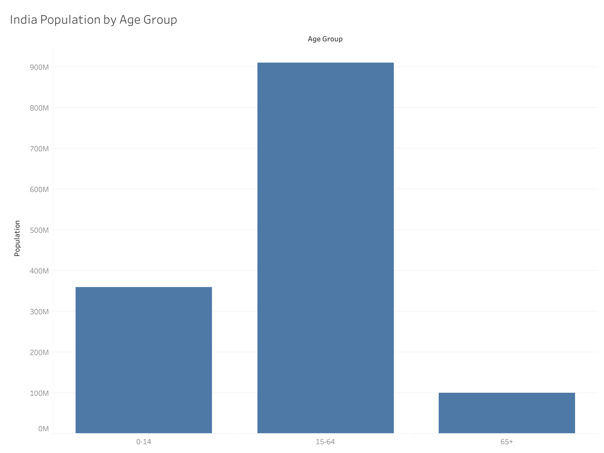

# SCT_DS_1
# 📊 India Population Distribution by Age Group (2022)

This project fulfills **Task 01**: _"Create a bar chart to visualize the distribution of a categorical or continuous variable, such as the distribution of ages or genders in a population."_

We visualize the **distribution of India's population** across three key age groups: **0–14**, **15–64**, and **65+**, using a **bar chart created in Tableau**.

---

## 📁 Dataset Information

- **Filename:** `India_Population_By_AgeGroup.csv`
- **Source:** Derived from World Bank indicators:
  - Total population: [SP.POP.TOTL](https://data.worldbank.org/indicator/SP.POP.TOTL)
  - Age structure (%): [0–14](https://data.worldbank.org/indicator/SP.POP.0014.TO.ZS), [15–64](https://data.worldbank.org/indicator/SP.POP.1564.TO.ZS), [65+](https://data.worldbank.org/indicator/SP.POP.65UP.TO.ZS)
- **Format:** Long format (ready for Tableau)

### 🔢 Sample Data

| Country Name | Year | Age Group | Population   |
|--------------|------|-----------|--------------|
| India        | 2022 | 0–14      | 360,000,000  |
| India        | 2022 | 15–64     | 910,000,000  |
| India        | 2022 | 65+       | 100,000,000  |

---

## 📈 Visualization

The following bar chart was created in Tableau:

> 

### 🎯 Insights
- **15–64** age group dominates the population, indicating a strong working-age demographic.
- **0–14** still represents a substantial share, reflecting future workforce potential.
- **65+** is relatively smaller, but growing due to improving life expectancy.

---

## 🛠️ Tools Used

- [Tableau Public](https://public.tableau.com/)
- Data from [World Bank Open Data](https://data.worldbank.org/)
- CSV reshaped into **long format** for easy use in Tableau

---

## 📌 How to Recreate This Chart

1. Download the CSV file from this repo
2. Open **Tableau**
3. Connect to `India_Population_By_AgeGroup_LongFormat.csv`
4. Drag:
   - `Age Group` → **Columns**
   - `Population` → **Rows**
5. Customize chart with labels, colors, and titles
6. Export the image if needed via `File > Export > Image`

---

## ✅ Status

- [x] Dataset Created
- [x] Bar Chart Created in Tableau
- [x] Exported Image Added
- [x] Task 01 Completed

